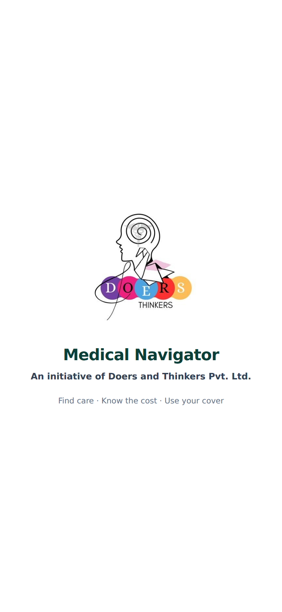
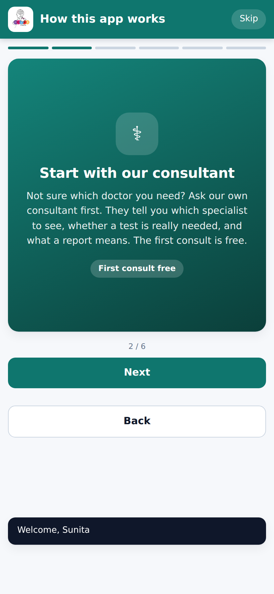
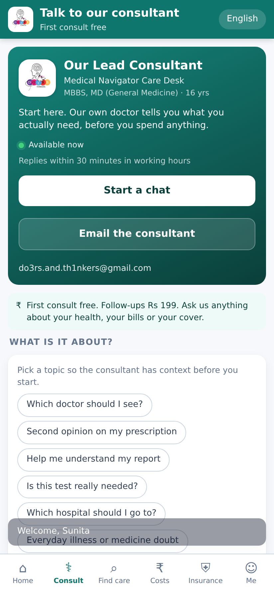
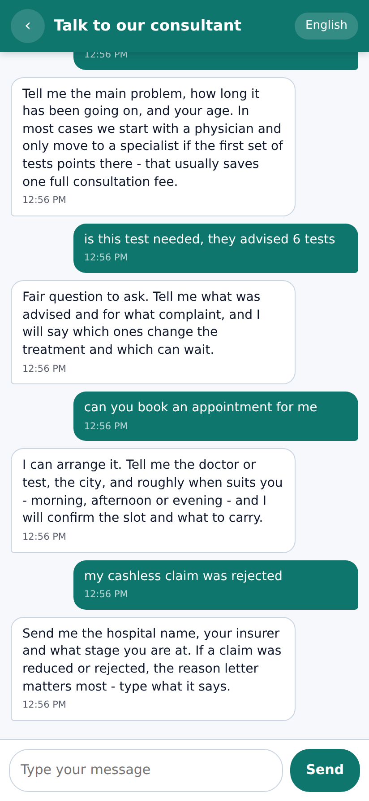
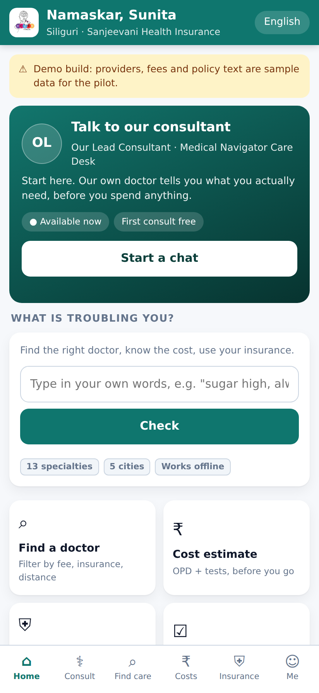
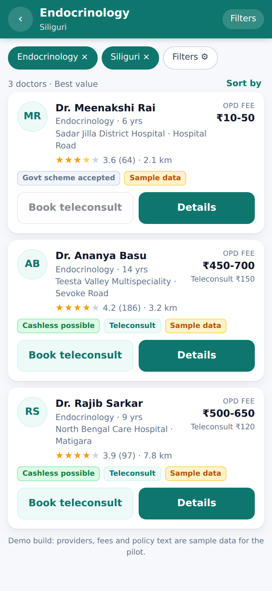
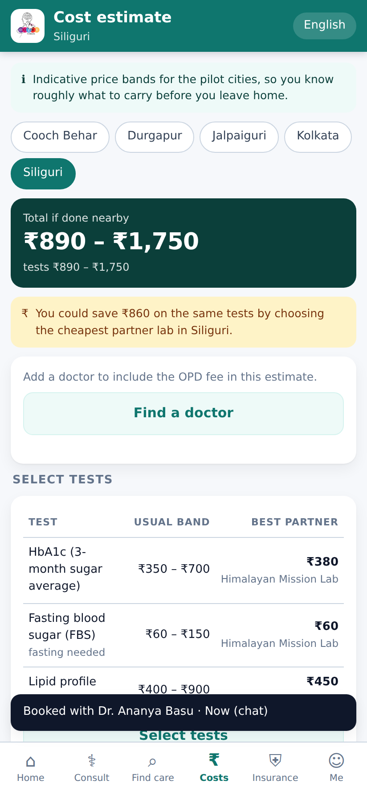
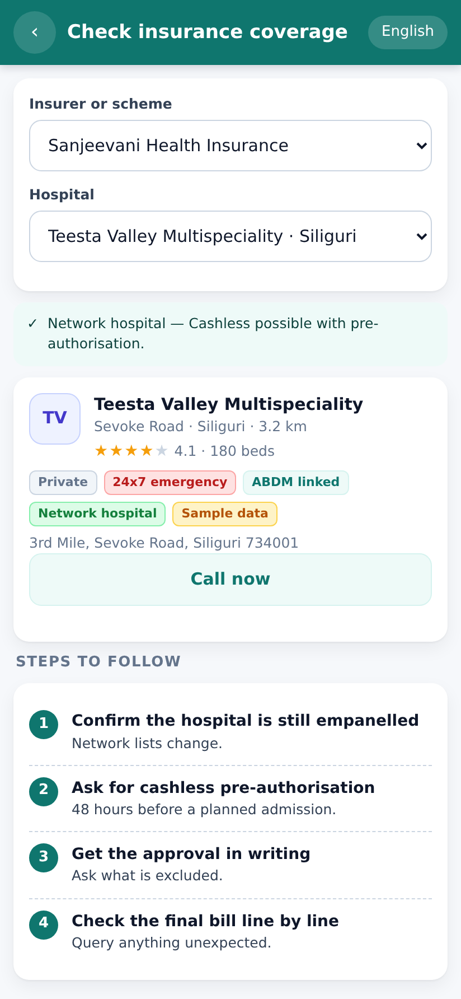

# Medical Navigator — Android MVP

<p align="center">
  <br />
  <em>An initiative of Doers and Thinkers Pvt. Ltd.</em>
</p>

**Talk to a doctor first. Then find the right care, at a price you knew in
advance, with your insurance actually working.**

The app opens on a consultant you can message straight away — our own, not a
name from a directory — because the most expensive mistake a patient makes is
guessing which specialist they need. Everything else in the app is what happens
after that question is answered.

Built for Tier-2/Tier-3 and semi-urban India — the pilot geography is Siliguri /
North Bengal and Kolkata — where the problem is rarely a shortage of doctors.
It is that a patient has no reliable way to answer four questions *before* they
leave the house:

| The question | What happens today | In the app |
|---|---|---|
| **Which kind of doctor do I even need?** | People start at the wrong specialist, or at whoever a neighbour recommends, and lose weeks and consultation fees finding out | Message our consultant — first consult free |
| **What will this actually cost me?** | The OPD fee is the small part. The tests that follow are the real bill, and nobody quotes them up front | Consultation + tests, priced at the cheapest partner lab |
| **Will my insurance work at this hospital?** | Cashless depends on the *hospital* being empanelled, not just on holding a policy. Patients discover this at the admission desk | A yes/no per hospital, plus the pre-auth steps |
| **Who is worth trusting?** | Ratings, fees and credentials live in scattered places, if anywhere | Ratings from patients who went, folded into the ranking |

Medical Navigator collapses those four into one flow. It does **not** diagnose,
prescribe, or replace a doctor. It does the navigation — the part that currently
costs patients money and time purely through lack of information.

**Download:** [`dist/MedicalNavigator-v1.2.0.apk`](dist/MedicalNavigator-v1.2.0.apk)
— ~140 KB, Android 7.0+ (API 24), installable and shareable over WhatsApp.

> **This is a pilot/demo build.** Every doctor, hospital, lab, insurer and policy
> clause in it is **fictional sample data**, clearly labelled as such inside the
> app. It is a navigation aid, not medical advice, and it does not diagnose.
> See [Honest limitations](#6-honest-limitations).

---

## 1. What it does

### The journey, in plain terms

A patient opens the app, picks their language, and enters a few facts once: city,
age, any ongoing condition, and their insurance if they have one. A short
**welcome guide** then explains, in six cards, what the app is for and what it
will not do — it is a guide, not a hospital, and it does not diagnose. From then
on every screen is filtered to *them*.

The guide hands them to the **consultant**, which is where the app wants every
journey to start. Our lead consultant is one tap away, by in-app message or by
email, with availability and a stated response time on screen. A patient who
does not know where to begin can simply ask: *which doctor should I see, is this
test really needed, what does this report mean, which hospital should I go to.*
The first consult is free, and topic chips let them name the question —
including booking help and insurance queries — so the consultant has context
before the conversation starts.

The consultant is presented **by role, not by name**. Patients reach the
Medical Navigator care desk and whoever is on duty answers; no individual
clinician is named anywhere in the app. The only two channels are the in-app
thread and `do3rs.and.th1nkers@gmail.com`, which the email button opens as a
pre-filled draft carrying the patient's topic, note, city and age.

If they would rather look for themselves, they describe the problem in their own words — "sugar high, always thirsty" —
and the app names the specialty they need and flags the symptoms that mean
**go to an emergency room instead of booking anything**. It then shows the
doctors of that specialty in their city, ranked so that a trustworthy cheap
option can beat an expensive one, and marked with whether that specific
doctor-and-hospital pair will actually settle *their* insurer cashless.

Before they commit, they see the **whole** likely cost: the consultation fee band
plus the tests that specialty usually orders, priced against the cheapest partner
lab in their city — so the number on screen is what they should carry, not just
the doctor's fee. They can book an OPD slot, or start a teleconsult chat where
the first ten minutes are free.

If an admission is coming, the insurance section answers the question that
actually decides the bill: *is this hospital cashless for me?* It gives a yes/no,
the exact pre-authorisation or reimbursement steps in order, the documents to
carry, the clauses that limit the claim, and — if the answer is no — the
cashless hospitals nearby that would have said yes.

Afterwards they rate the doctor, the hospital and how the insurance help went.
The doctor and hospital ratings are folded straight back into that provider's
aggregate, which re-orders the search results — so the directory is corrected by
the people using it rather than by whoever paid for placement. That loop is the
product thesis: **the navigator should get more useful the more it is used,
without anyone having to trust a brand.** In this build the loop closes on the
device only; pooling ratings across patients needs the Phase-II backend.

### Feature by feature

| Area | In this build |
|---|---|
| **Consultant** *(primary)* | The in-house consultant, reachable two ways: **in-app message** or **email** (`do3rs.and.th1nkers@gmail.com`). Identified by role, never by a personal name. Shows live availability, a stated response time, credentials and a free first consult; nine topic chips give context before the conversation starts. Threads are kept under *My consultations* |
| **Welcome guide** | Six cards shown once after sign-up — what the app is, why to start with the consultant, how search, costs and insurance work, and where the data lives. Re-openable any time from **Me → How this app works** |
| **Onboarding** | Language choice (English / हिन्दी / বাংলা), mobile-OTP flow, profile: age, sex, city, ongoing conditions, insurer + plan, optional ABHA ID |
| **Problem → specialty** | Type the problem in plain words ("sugar high, always thirsty") → rule-based routing to the right specialty, with **red-flag emergency warnings** |
| **Doctor & hospital search** | Filter by specialty, city, **max OPD fee**, *accepts my insurance*, teleconsult available, govt-scheme accepted, rating, distance. Five sort modes including a **best-value** rank (rating per rupee) |
| **Cost guidance** | OPD fee band + the tests that specialty usually advises + **cheapest partner-lab price per test**, with the total and the saving if you use a partner lab |
| **Interaction** | Slot booking for teleconsult or OPD; a teleconsult chat thread with a "first 10 minutes free" rule and specialty-aware canned replies |
| **Insurance assistance** | Is this hospital **cashless for me**? → network verdict, step-by-step pre-auth / reimbursement flow, what-to-carry checklist, grouped policy clauses (covered / limits / waiting / not covered / process), cashless alternatives nearby, and a 5-stage claim tracker |
| **Feedback loop** | Rate the doctor, the hospital and the insurance help after a visit. Ratings **fold straight into the aggregate**, so one patient's feedback changes what the next patient in that city sees |
| **My records** | Local notes for readings, prescriptions and report values |
| **Emergency** | One-tap dial for 108 / 112 / 104 / 14416 / 1098 / 181 / 14555 plus the nearest hospitals with a 24×7 emergency unit |
| **Pilot metrics** | On-device funnel (search → doctor view → booking → completed → rated) with conversion rates, so a pilot team can read retention and conversion without any server or tracking SDK |

### Branding

The Doers and Thinkers mark appears on the launch screen, in the app bar, on the
consultant card, on the first card of the welcome guide and on the About screen.
The native launch window (`res/drawable/launch_screen.xml`) is deliberately the
same picture as the in-app splash, so there is no flash of a different colour
between the two. The launcher icon stays the existing teal cross: the brand mark
is fine line art with wordmarks that do not resolve at launcher-icon sizes or
survive adaptive-icon cropping.

### Why it all runs on the phone

Everything above works with the aeroplane mode on: no account, no server, no
analytics SDK, and no data leaves the device. That is a deliberate design
choice, not a limitation of the prototype. Health information is the most
sensitive category a person has; connectivity in the target belt is patchy and
metered; and a 90 KB APK installs over a bad connection and shares peer-to-peer
over WhatsApp, which is how apps actually spread in this market. A patient can
check whether a hospital is cashless for them while standing at its gate with
no signal.

### Screenshots

Captured from the UI test run; the full set lands in `build/screens/`.

| Splash | Welcome guide | Consultant | Consult chat |
|---|---|---|---|
|  |  |  |  |

| Home | Search results | Cost estimate | Insurance check |
|---|---|---|---|
|  |  |  |  |

### The blueprint's Siliguri scenario, end to end

The 45-year-old woman in Siliguri with type-2 diabetes is the app's main test
path (asserted in `tools/test/ui-smoke.js`):

1. Signs up with mobile OTP → diabetes, 45, Siliguri, *Sanjeevani Health Insurance — Silver*, then reads the six-card welcome guide.
2. Lands on the consultant and messages the care desk: *"sugar is high and I do not know which doctor to see"* — and is told to start with a physician unless the first tests point elsewhere, which saves a specialist's fee.
3. Types "sugar high and always thirsty" → routed to **Endocrinology**, with a red-flag warning for ketoacidosis symptoms.
4. Filters to Siliguri + *accepts my insurance* + OPD under ₹700 → 3 doctors, from a ₹10–50 district-hospital OPD to a ₹450–700 specialist.
5. Doctor profile shows OPD ₹450–700, commonly advised tests (HbA1c, FBS, PPBS, lipid, KFT, urine microalbumin) and an **estimated total** for the visit.
6. Books a ₹150 teleconsult (first 10 minutes free) and chats; the endocrinologist's reply asks for her readings and points at the cheaper partner labs.
7. Taps **Check insurance coverage** for the hospital → *network hospital, cashless possible*, the 4-step pre-auth flow, and the documents checklist.
8. After the visit she rates doctor / hospital / insurance help, which moves the ranking for the next patient in Siliguri.

---

## 2. Install the APK

**On your own phone**

1. Copy `dist/MedicalNavigator-v1.2.0.apk` to the phone (WhatsApp, Drive, USB, email).
2. Open it. Android will ask to allow installs from that source — allow it for
   that app only (Settings → Apps → *the app you opened it from* → Install unknown apps).
3. Play Protect may warn that the app is not from the Play Store; choose
   **Install anyway**. It is self-signed, which is expected for a pilot build.

**Sharing over WhatsApp:** attach the `.apk` as a *Document* (not as a photo/video).
WhatsApp keeps the file intact; the recipient taps it and installs as above.

Requirements: Android 7.0 (API 24) or newer, any ABI (no native code), ~5 MB of
storage. The app works fully offline.

---

## 3. Build it yourself

```bash
./tools/fetch-toolchain.sh   # one-off: pulls the build tools into .toolchain/
./tools/build.sh             # -> dist/MedicalNavigator-v<version>.apk
```

Requirements: JDK 17+, Python 3, `curl`, `unzip`, and network access to Maven Central.

### Why there is no Gradle / Android SDK

This project is built inside a locked-down environment where `dl.google.com`
is blocked by egress policy — which takes out `sdkmanager`, the Android SDK and
Google's Maven mirror, and therefore the Android Gradle Plugin. So `tools/build.sh`
drives the same pipeline AGP would, using only artifacts published on **Maven Central**:

| Stage | Tool | Sourced from |
|---|---|---|
| Compile resources + link APK | `aapt2` 2.20 | `org.apktool:apktool-lib` (ships the Linux `aapt2` binary) |
| Framework resources for `-I` | `android-framework.jar` | `org.apktool:apktool-lib` |
| `android.jar` compile classpath | API 34 framework classes | `org.robolectric:android-all`, stripped of its `java.*`/`javax.*`/`sun.*` libcore copies so it cannot collide with the JDK's own platform classes |
| Java → Dalvik bytecode | `dx` (AOSP, repackaged) | `com.jakewharton.android.repackaged:dalvik-dx` |
| Zip alignment | `tools/zipalign.py` | 60 lines of Python: pads STORED entries to a 4-byte boundary (4096 for `.so`) and keeps `resources.arsc` uncompressed, as API 30+ requires |
| Signing + verification | `tools/signer/ApkTool.java` | `com.android.tools.build:apksig` |

The build emits **APK Signature Scheme v2** only. The v1 (JAR) signer in the
Maven-published `apksig` calls `sun.security.pkcs.PKCS7` internals that were
removed after JDK 11, and v2 has been the requirement for apps targeting API 30+
anyway — hence `minSdkVersion 24`, where v2 verification landed.

**If you have a real Android SDK, use it.** The pipeline only needs `aapt2`, a
dexer, `android.jar` and `apksigner`; point `tools/build.sh` at
`$ANDROID_HOME/build-tools/<ver>` and `$ANDROID_HOME/platforms/android-34`.

### Signing key

The first build generates `.keystore/mednav.p12` (gitignored, password in
`tools/build.sh`). **Keep that file**: a different key means an existing install
must be uninstalled before the new APK will install over it. For a real release,
generate a key you control and pass it via `KEYSTORE`, `KEY_ALIAS`, `KEY_PASS`.

---

## 4. Architecture

A **hybrid** app: a thin, auditable native shell around a local single-page UI,
with a real SQLite data layer on the native side.

```
MainActivity (WebView host)  ──addJavascriptInterface──▶  NativeBridge
      │  file:///android_asset/www/index.html                    │
      │                                                          ▼
      │                                              Repo  (JSON in / JSON out)
      │                                                          │
      ▼                                                          ▼
 assets/www  (SPA: no framework, no CDN)              DbHelper / SeedData  (SQLite)
```

| File | Role |
|---|---|
| `app/src/main/java/.../MainActivity.java` | Single activity, WebView configuration, external-scheme handling (`tel:`, share), hardware-back contract |
| `.../NativeBridge.java` | The **only** surface the UI can reach: one `call(op, json)` data entrypoint plus share / dial / email / clipboard / toast / haptics. Email uses `ACTION_SENDTO` on a `mailto:` URI, so only mail apps can claim it. No reflection, no generic intent launching |
| `.../Repo.java` | Every query and mutation, 29 operations, JSON in / JSON out — the shape a Phase-II REST backend would take. Care-team threads and doctor teleconsults share one `messages` table, so `send_message` resolves whichever owns the thread id |
| `.../DbHelper.java` | Schema (20 tables) and seeding, with migrations for the consultant tables (v1.1.0) and the consultant email column (v1.2.0). Reference data is disposable and re-seeded on upgrade; patient data is never touched |
| `.../SeedData.java` | The shipped pilot dataset as pipe-delimited rows |
| `app/src/main/assets/www/` | The UI: `native.js` (bridge), `i18n.js` (en/hi/bn), `ui.js` (DOM toolkit), `cards.js`, `app.js` (router + state), `screens/*.js` — including `consult.js` (the consultant) and `guide.js` (the welcome guide) |

**Why a WebView rather than Compose/RN/Flutter?** With no Android SDK and no
AndroidX available in this environment, the realistic native options were raw
framework `View`s — which would have cost far more code for a far worse UI. The
hybrid split keeps the native surface small enough to review in one sitting while
the UI stays rich. The JS is framework-free and loaded from `assets`, so the APK
is ~90 KB and starts fast on entry-level phones. Migrating the UI to React
Native or Flutter later does not change the `Repo` contract.

### Security posture

- The WebView loads **only** bundled assets. `usesCleartextTraffic="false"`, universal/file access from file URLs disabled, multiple windows disabled, `MIXED_CONTENT_NEVER_ALLOW`.
- A Content-Security-Policy meta locks the page to `default-src 'none'` with `connect-src 'none'` — the UI has no way to reach the network at all.
- `ACTION_DIAL`, never `ACTION_CALL`, so the app holds no call permission.
- Permissions requested: `INTERNET`, `ACCESS_NETWORK_STATE`, `VIBRATE`. Nothing else — no location, no contacts, no storage.
- All patient data lives in the app's private SQLite database and can be erased from **Me → Erase my data**.

---

## 5. Tests

```bash
NODE_PATH=$(npm root -g) node tools/test/ui-smoke.js     # 98 assertions
```

This drives **the exact assets that ship in the APK** in headless Chromium over
`file://` — the same scheme and CSP the WebView uses — against a bridge test
double (`tools/test/mock-bridge.js`) backed by the **real seed data**, parsed
straight out of `SeedData.java` by `tools/test/seed-parser.js`. It walks the
whole journey (splash branding → onboarding → welcome guide → consultant → consult chat → email
→ triage → search → filters → doctor → booking → teleconsult → cost → insurance
→ rating → records → metrics → emergency), asserts the native hand-offs fire,
checks the back-button contract and the three languages, fails on any console
error, and writes screenshots to `build/screens/`.

The parser also validates every seed row's field count, so a malformed seed row
fails the test run rather than the app.

**What is not tested:** nothing here executes on a real Android runtime. No
emulator was available (the Android SDK is unreachable from this environment),
so `MainActivity`, `NativeBridge` and `Repo` are verified by compilation, review
and the APK-level checks (`apksig` verification and `aapt2 dump badging`) — not
by running them. **Smoke-test the APK on a real device before any pilot.**

---

## 6. Honest limitations

These are deliberate MVP scope cuts, and the app says so on the screens where
they matter:

- **All provider data is fictional.** Doctors, hospitals, labs and insurers are invented; fees and test prices are indicative bands, not quotations. Real listings require consent-verified onboarding and a curated feed.
- **Policy clauses are illustrative sample wording**, not any real product's terms. Insurer names are fictional; the two government schemes (PM-JAY, Swasthya Sathi) are described only in broad, publicly documented terms.
- **The consultant profile is placeholder data** and the replies — like the teleconsult replies — come from a fixed rule table, not a live clinician. The chat says so at the top of every thread. Availability, response times and fees are illustrative until a real clinician is rostered behind it.
- **The email channel is real, the mailbox is not monitored by this build.** Tapping *Email the consultant* genuinely opens the phone's mail app with a draft to `do3rs.and.th1nkers@gmail.com`; whether anyone answers is an operational matter, not a code one.
- **There is no phone, WhatsApp or video channel.** In-app message and email are the only two ways to reach the consultant, by design.
- **Teleconsult replies come from a fixed rule table**, not a clinician. This is stated in the chat itself.
- **OTP is generated and displayed on the device** — no SMS gateway (MSG91 / Twilio) is wired up.
- **No payment gateway**, so no money moves and no real appointment is created.
- **Policy-document parsing is not implemented** (as the blueprint scopes for MVP: pre-parsed text, no AI). The reader shows sample clauses.
- **Triage is keyword rules, not AI** — a deliberate choice: every mapping stays auditable by a clinician, and it cannot hallucinate. Red-flag warnings are attached to each condition.
- **Clinical content is English-only.** The UI chrome is translated to Hindi and Bengali; machine-translating clinical text without clinician review would be the wrong shortcut.
- **No ABDM/ABHA integration.** The profile stores an ABHA number for later linking.
- **The ratings loop is on-device.** Feedback re-ranks the directory on the phone that gave it; it does not reach other patients until there is a backend to pool it.

---

## 7. Roadmap

**Phase-I (pilot readiness)** — roster the consultant for real (and add an after-hours associate, a care coordinator and an insurance desk, which the seed's `role` column already supports) and route the shared inbox into a ticketed queue; real provider onboarding with consent and verification; SMS OTP gateway; server-side directory with an offline cache; clinician review of the triage table and every red flag; a device smoke-test matrix; legal review of the insurance wording.

**Phase-II** — real doctor availability and calendars; live chat plus WebRTC video; payments (UPI); policy-document parsing; ABDM/ABHA record linking; TPA/insurer API integration for genuine pre-auth status; lab-partner booking and home collection; clinician-reviewed Hindi/Bengali clinical content.

**Phase-III** — care pathways for chronic disease, family accounts, pharmacy price comparison, employer/insurer distribution, and a provider-side app.

---

## 8. Repository layout

```
app/src/main/
  AndroidManifest.xml
  java/com/mednav/navigator/   MainActivity, NativeBridge, Repo, DbHelper, SeedData
  res/                         icon (adaptive + generated PNG), theme, launch screen
  assets/www/                  the SPA (img/logo.jpg, screens/consult.js, screens/guide.js)
tools/
  fetch-toolchain.sh           pulls the Maven-only build toolchain
  build.sh                     aapt2 -> javac -> dx -> align -> sign -> verify
  zipalign.py                  alignment-aware APK assembler
  mkicon.py                    generates the legacy launcher PNG with no image libraries
  signer/ApkTool.java          apksig-based signer + verifier
  test/                        seed parser, bridge test double, UI smoke test
dist/MedicalNavigator-v1.2.0.apk
```

---

*Pilot build. Not medical advice, not a diagnosis, and not a substitute for
seeing a doctor. For a medical emergency in India, call 108 or 112.*
